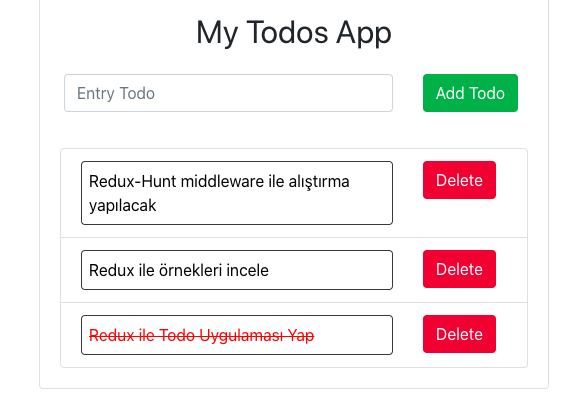

# React & Redux with Todo Application 
React & redux; I developed with. An application where you can add, delete and list our todo.

## Live Link of the Project

[https://ekremtas.github.io/react-todo-app](https://ekremtas.github.io/react-todo-app)

## Libraries I Use
[React](https://www.npmjs.com/package/react)

[Redux](https://www.npmjs.com/package/redux)

[react-redux](https://www.npmjs.com/package/react-redux)

[redux-thunk](https://www.npmjs.com/package/redux-thunk)

[reactstrap](https://www.npmjs.com/package/reactstrap)

## Run The Project
```
$ yarn install
```
After installing packages with

```
$ yarn start
```
You can run the project with.

# Sample Picture from the Project


## Resources

-   Managing State in Modern React Apps:  [https://developerhandbook.com/react/managing-state-modern-react-web-applications/](https://developerhandbook.com/react/managing-state-modern-react-web-applications/)
-   Bir JavaScript developer neden Redux Ogrenmeli:  [https://www.robinwieruch.de/redux-javascript](https://www.robinwieruch.de/redux-javascript)
-   React ve Redux'ta immutability(degismezlik):  [https://daveceddia.com/react-redux-immutability-guide/](https://daveceddia.com/react-redux-immutability-guide/)
-   A carton intro to redux:  [https://code-cartoons.com/a-cartoon-intro-to-redux-3afb775501a6](https://code-cartoons.com/a-cartoon-intro-to-redux-3afb775501a6)
-   Redux ile bookshop uygulamasi:  [https://scotch.io/tutorials/build-a-bookshop-with-react-redux-i-react-redux-flow](https://scotch.io/tutorials/build-a-bookshop-with-react-redux-i-react-redux-flow)
-   React-Redux resmi dokumani:  [https://react-redux.js.org/introduction/quick-start](https://react-redux.js.org/introduction/quick-start)
-   Redux dev tools:  [https://github.com/zalmoxisus/redux-devtools-extension](https://github.com/zalmoxisus/redux-devtools-extension)
-   Container ve Presentational Components:  [https://medium.com/@dan_abramov/smart-and-dumb-components-7ca2f9a7c7d0](https://medium.com/@dan_abramov/smart-and-dumb-components-7ca2f9a7c7d0)
-   React&Redux ogrenmek icin ipuclari:  [https://www.robinwieruch.de/tips-to-learn-react-redux](https://www.robinwieruch.de/tips-to-learn-react-redux)
-   Redux nedir? (TURKCE):  [http://devnot.com/2018/redux-nedir/](http://devnot.com/2018/redux-nedir/)
